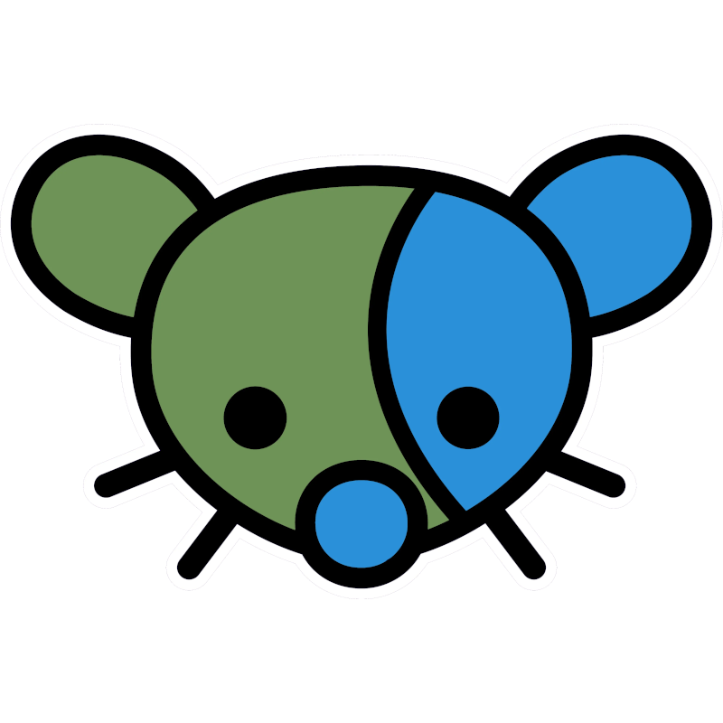

# StellarSt0rm · $\color{mediumorchid}\text{she/her}$
Hi! You can call me May, I $\color{magenta}\text{LOVE}$ programming and cats, and $\color{red}\text{HATE}$ M$ and JavaScript. \
My favorite GitHub emoji is :shipit:

#### I am migrating to Codeberg, i will slowly migrate all of my repositories to Codeberg. To access my repositories you'll have to go to: https://codeberg.org/StellarSt0rm

## Personal $\color{green}\text{Roadmap}$ (2025) · ⭐ = Currently Doing
- [x] Remake my [website](https://github.com/StellarSt0rm/stellarst0rm.github.io) using Rust as a preprocessor
- [ ] Fully learn Rust
  - [ ] Read the [Rust book](https://rust-book.cs.brown.edu) ⭐
  - [ ] Maybe read the [Rustonomicon](https://doc.rust-lang.org/nomicon/intro.html)?

## Social $\color{magenta}\text{Links}$
 [StellarSt0rm@proton.me](mailto:StellarSt0rm@proton.me)

 [StellarSt0rm:matrix.org](https://matrix.to/#/@stellarst0rm:matrix.org) \
 [StellarSt0rm@lemmy.world](https://lemmy.world/u/StellarSt0rm)

 [stellarst0rm.github.io](https://stellarst0rm.github.io)

## Useless $\color{blue}\text{Statistics}$:

  <!-- Stats -->
  
  
  <!-- Top Langs. JavaScript excluded because i hate JavaScript. -->
  

    
    
  

